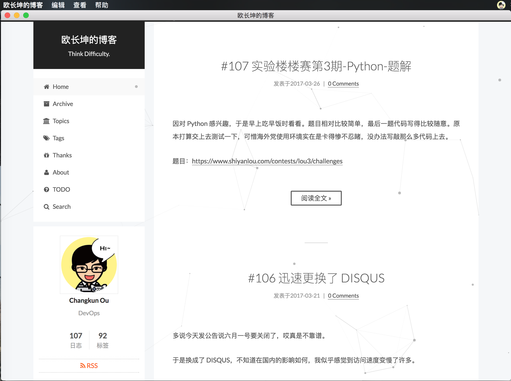
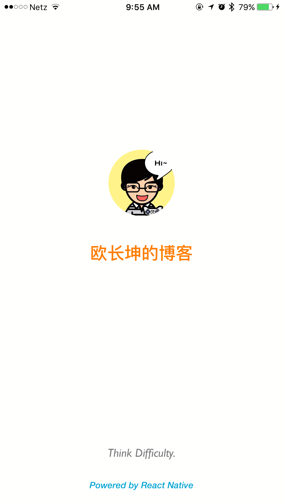
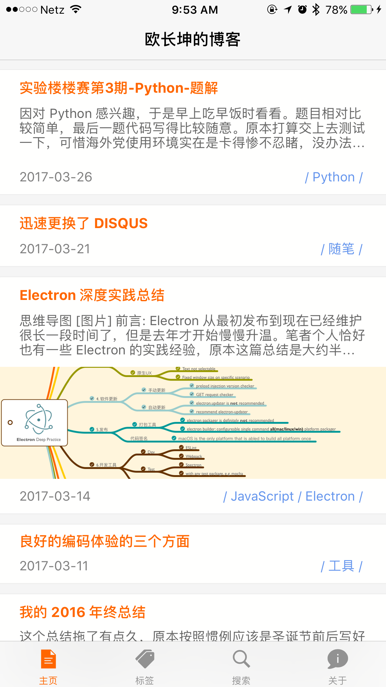

# Changkun's Blog Clients

[*Changkun's Blog*](https://changkun.us/) *Desktop&Mobile Clients, powered by* [*Electron*](http://electron.atom.io) & [*React Native*](http://facebook.github.io/react-native/).

## Desktop Version

Desktop clients support `macOS/Windows/Linux(Ubuntu)` platform. If you would like to only build desktop version, the following instractions help you to build desktop clients.

To install dependencies:

```bash
npm install
# or
yarn install
```

To build all platform:

```bash
npm run build
# or
yarn run build
```

To build specific platform:

```bash
npm run build-mac       # for macOS x64
npm run build-win       # for windows x64
npm run build-linux     # for linux ubuntu x64
# or
yarn run build-mac
yarn run build-win
yarn run build-linux 
```

TO build release version to Github, you need provide your Github token, and change the provider and repository info in the `package.json`, then:

```bash
export GH_TOKEN="YOUR_TOKEN" npm run build-release
```

> Please note that 32-bit version is not recommended, I will never support that.

### Preview

<div style="display: flex; justify-content: center">
	
</div>

## Mobile Version

Mobile Version is currently in development. You could check the [mobile](./mobile/Blog) folder for details.

Go to `./mobile/Blog`, then

To install dependencies:

```bash
npm install react-native-cli -g
npm install
# or
yarn install react-native-cli -g
yarn install
```

To run for iOS:

```bash
react-native run-ios
```

To run for Android:

```bash
react-native run-android
```

### Preview

<div style="text-align: center;">
	<div style="display: inline; ">
	
	</div>
	<div style="display: inline;">
	
	</div>
</div>


### TODO

#### Server Side API Design

> At present, mobile version requires the API generate from `hexo-generator-restful`, which gives bad API design, we need reimplement it.

- [x] posts.json, `posts.data` contains post object array, the `post` object contains: 
	+ title: article title
	+ excerpt: article excerpt, if exists
	+ cover: article image cover, if exists
	+ date: article publish date, format: YYYY-MM-DD
	+ tags: tag array, maximum to 3
	+ path: path to access article itself
- [x] tags.json, contains tag objects array, tag object contains:
	+ name: tag name
	+ path: article with the tag
	+ count: article statistic
	+ api/tags/<tag>.json
		+ `tag.postlist` contains `post` objects as an array
- [x] about.json
	+ this improves `hexo-generator-restful`

#### Client Side Design 

- [ ] Pull-down & pull-up refresh for ListView component
- [ ] Markdown Post page component
- [ ] Post cell navigator
- [ ] Local data persistent --> local cache
- [x] Tags Cloud page
- [ ] Tags Cloud page navigator
- [ ] Local data fuzzy search
- [x] About page component
- [ ] Comments enable
- [ ] Dark Mode
- [ ] Internationalization
- [ ] Android Support

## License

Copyright &copy; 2016 Changkun Ou. All rights reserved.

The code is distributed under the MIT license. See [LICENSE](./LICENSE) in this directory for more details.


